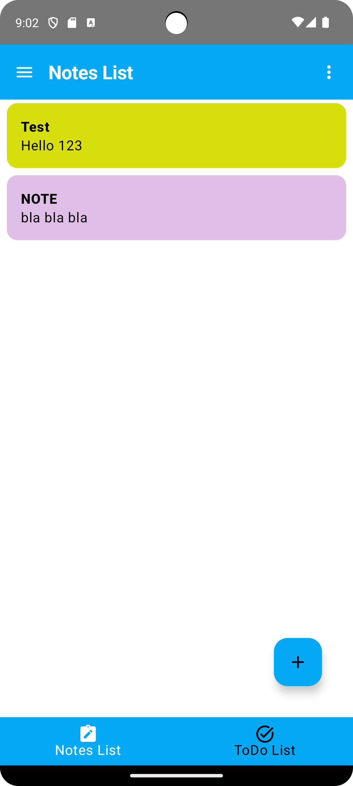
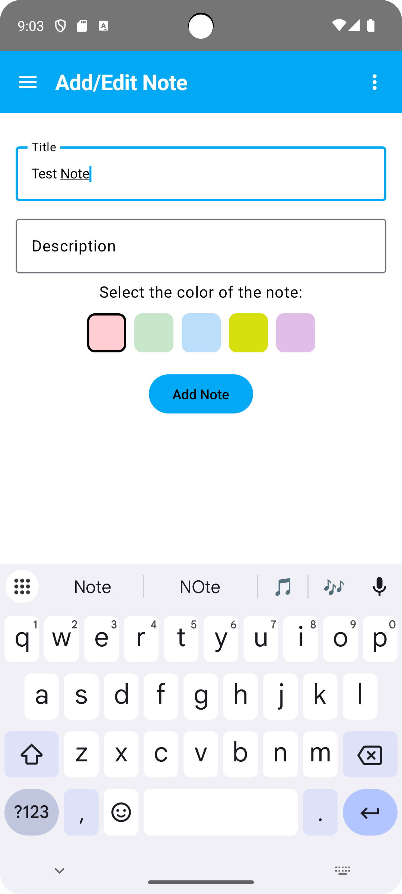
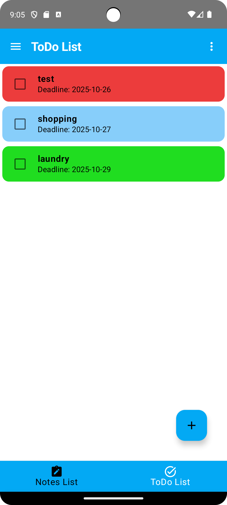
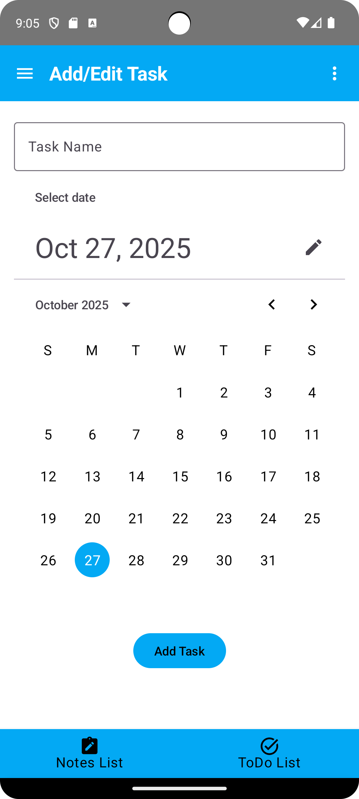
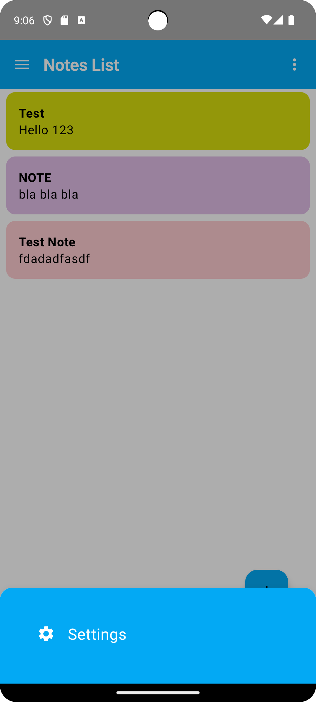
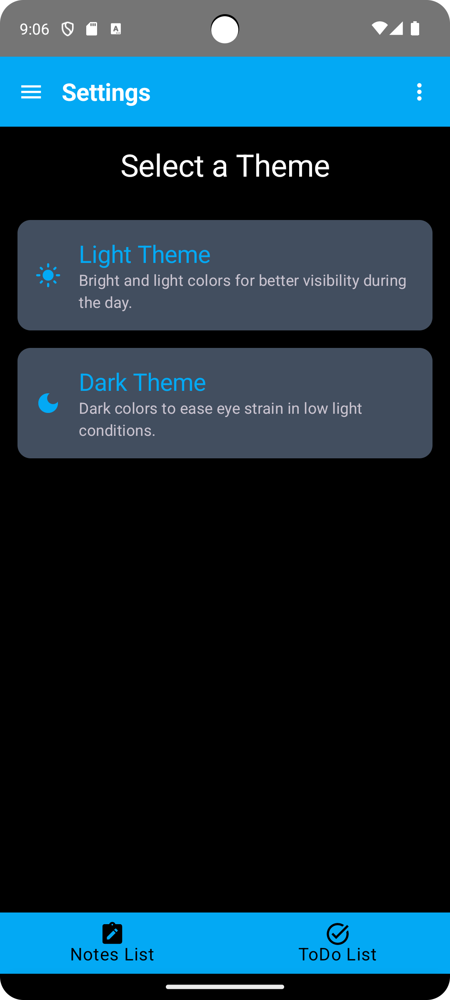
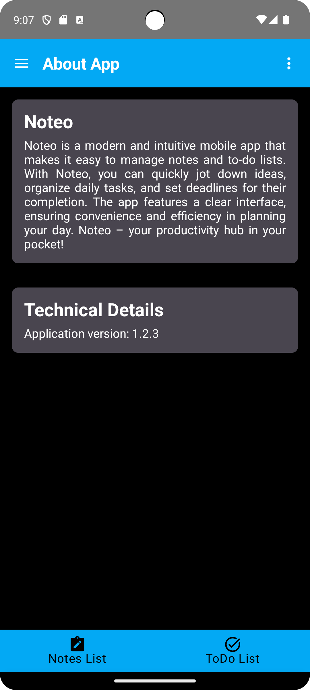

# Noteo

**Noteo** is a modern Android application that allows users to **create, manage, and organize notes and tasks** in one place.  
It’s built using **Kotlin**, **Jetpack Compose**, and **Room Database**, featuring a sleek and minimal Material 3 interface with **light and dark themes**.

## Galeria

<p align="center">
  
  
  
  
</p>

<p align="center">
  
  
  

</p>

---

## Table of Contents

1. [Overview](#overview)
2. [Features](#features)
3. [Application Flow](#application-flow)
4. [Architecture](#architecture)
5. [UI and Navigation](#ui-and-navigation)
6. [Database Layer](#database-layer)
7. [Themes and Preferences](#themes-and-preferences)
8. [Project Structure](#project-structure)
9. [How to Run](#how-to-run)
10. [Future Improvements](#future-improvements)
11. [Author](#Author)

---

## Overview

Noteo is designed to make everyday task and note management intuitive and visually appealing.  
It provides two main modules:
- **Notes** — quick note-taking with color categorization,
- **To-Do Tasks** — a structured way to plan daily or future activities.

The app provides smooth navigation, persistent data storage, and customizable appearance.

---

## Features

### Notes Management
- Create, edit, and delete notes.
- Assign custom colors to notes for better organization.
- Real-time updates using Kotlin `Flow` and reactive Compose UI.
- Swipe to delete notes easily.
- Input validation ensures notes have both title and description before saving.

### Task Management
- Add and edit tasks with due dates using a Material 3 DatePicker.
- Automatically marks tasks with visual colors based on due date:
  - **Red:** overdue tasks
  - **Blue:** tasks for today
  - **Green:** future tasks
- Mark tasks as completed via checkboxes.
- Swipe to delete tasks instantly.
- Smart validation ensures every task has a name and date.

### Theming
- Two built-in visual modes:
  - **Light Theme** — bright and clean interface.
  - **Dark Theme** — darker tones for low-light use.
- Theme preference saved locally using `SharedPreferences`.

### Navigation & UI
- **Bottom Navigation Bar** — quick switching between Notes and To-Do sections.
- **Drawer Navigation** — access “About App” and “Contact” sections.
- **Top Bar** — displays current screen name and includes access to menu and drawer.
- **Bottom Sheet Menu** — provides quick access to Settings.
- Entirely built with **Jetpack Compose Material 3** — no XML layouts.

### Additional Features
- “About App” section with app description and version info.
- “Contact” section with developer details (name, phone, email).

---

## Application Flow

### 1. Home Screen (Notes)
When the app launches, the user is greeted with a list of saved notes.  
Each note shows its **title**, **description**, and **color tag**.  
Users can:
- Tap a note to edit it.
- Swipe left to delete it.
- Press the **“+”** button to add a new note.

### 2. Add/Edit Note Screen
Users can:
- Enter a **title** and **description**.
- Choose a background **color** for the note.
- Save the note to local storage via Room.
- If editing an existing note, fields are pre-filled automatically.

### 3. To-Do List Screen
Displays a list of tasks sorted by date.  
Each task shows:
- Task name,
- Due date,
- Status (done/pending).

Visual cues help the user identify urgency:
- Overdue (red),
- Today (blue),
- Upcoming (green).

Tasks can be checked off or deleted by swiping.

### 4. Add/Edit Task Screen
Users can create or modify a task:
- Type a name.
- Pick a due date using the built-in `DatePicker`.
- Tap “Add” or “Update” to save the task.
Tasks are stored persistently in the database.

### 5. Settings Screen
Allows switching between **Light** and **Dark** themes.  
The selection is remembered between app sessions.

### 6. Drawer Screens
- **About App:** Displays app name, description, and version.
- **Contact:** Lists developer info in visually styled cards.

---

## Architecture

The app follows the **MVVM (Model-View-ViewModel)** architecture pattern.

### Model Layer
Contains:
- Room **entities** (`Note`, `Task`),
- **DAOs** for database access,
- **Repositories** for abstracting data operations.

### ViewModel Layer
Holds app logic and LiveData/Flow streams for:
- Notes (`NoteViewModel`),
- Tasks (`TaskViewModel`),
- Theme and navigation (`MainViewModel`).

Each ViewModel interacts with repositories asynchronously using **Kotlin Coroutines**.

### View Layer
Built entirely in **Jetpack Compose**, providing reactive, declarative UI components.  
Screens automatically update when ViewModel states change.

---

## UI and Navigation

- Navigation is handled using **Compose Navigation**.
- Screens are defined as `sealed class` objects (`Screen`, `BottomScreen`, `DrawerScreen`).
- Navigation hierarchy:
  - Bottom navigation: Notes & Tasks
  - Drawer: About & Contact
  - Modal bottom sheet: Settings

UI components are modular and reusable (TopBar, BottomBar, DrawerContent).

---

## Database Layer

Data is managed locally using **Room**.

### Notes Table
| Column        | Type   | Description               |
|----------------|--------|---------------------------|
| id             | Long   | Primary key               |
| note_name      | Text   | Note title                |
| note_details   | Text   | Note description          |
| note_color     | Int    | ARGB color value          |

### Tasks Table
| Column        | Type   | Description               |
|----------------|--------|---------------------------|
| id             | Long   | Primary key               |
| task_name      | Text   | Task title                |
| due_date       | Long   | Timestamp (milliseconds)  |
| is_done        | Bool   | Completion status         |

All queries use **Kotlin Flow**, enabling reactive UI updates.

---

## Themes and Preferences

- Defined in `LightTheme.kt` and `DarkTheme.kt`.
- Colors and typography follow Material 3 standards.
- User theme choice is persisted in `ThemePreference` using `SharedPreferences`.
- The ViewModel automatically applies saved theme on app startup.

---

## Project Structure

```
com.example.noteo/
│
├── app/
│   ├── model/
│   │   ├── note/           # Note entity, DAO, and repository
│   │   ├── task/           # Task entity, DAO, and repository
│   │   └── Graph.kt        # Provides repositories and Room database
│   │
│   ├── view/
│   │   ├── main/           # Main structure (TopBar, BottomBar, Drawer)
│   │   ├── bottomView/     # Notes and To-Do Composables (CRUD views)
│   │   ├── bottomSheet/    # Settings and More menu
│   │   ├── drawer/         # About and Contact screens
│   │   └── navigation/     # Navigation setup
│   │
│   └── viewModel/          # ViewModels for Notes, Tasks, and Theme
│
├── ui/theme/               # Color schemes, typography, preferences
└── MainActivity.kt         # App entry point
```

---

## How to Run

1. Clone the repository:
   ```bash
   git clone https://github.com/yourusername/Noteo.git
   ```

2. Open the project in **Android Studio (Arctic Fox or newer)**.

3. Ensure you have:
   - Minimum SDK: **Android 8.0 (API 26)**
   - Gradle plugin: **8.x or newer**

4. Build and sync the project.

5. Run the app on an emulator or device.

---

## Future Improvements

- Add **search and filtering** for notes and tasks.
- Integrate **Firebase authentication** for multi-device sync.
- Implement **notifications/reminders** for upcoming tasks.
- Support **note categories** and **priority levels**.
- Enable **cloud backup and restore**.

---

## Author

Created by Mateusz Turowicz